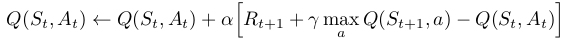
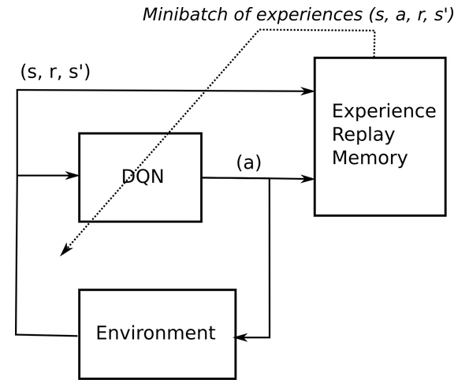
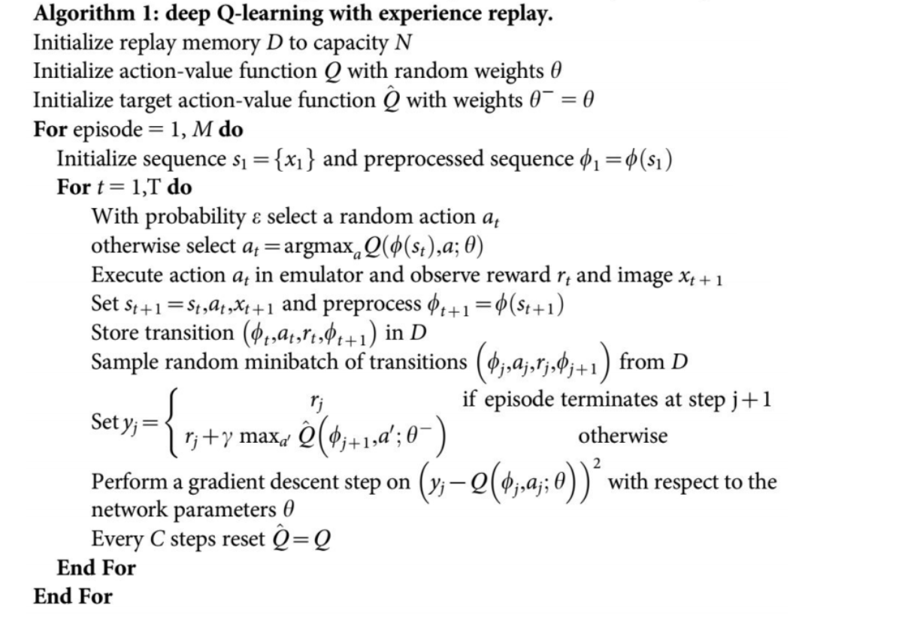
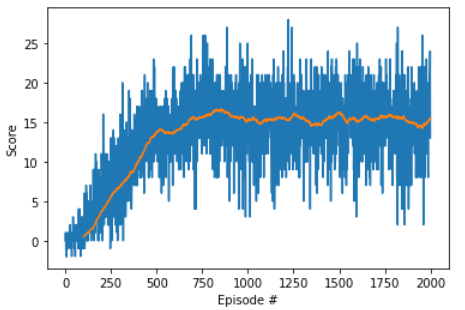

# Project 1: Collecting bananas with DQN agent

In this project, to solve the problem of collect yellow bananas and no collect blue bananas by an agent on Unity's environment, it was used a  Deep Q-Network (DQN) agent. Below are presented the learning algorithm, a few details of the agent, and results obtained.

# Learning Algorithm

It was used DQN algorithm with experience replay, to train the agent to collect bananas. A Deep Neural Network was used as the approximation function of action-value function Q(s,a).

The objective of the learning algorithm is to find the best parameters for the approximation function chosen to approximate the action-value function:

  

Experience replay is a technique to improve DQN performance. In short it consists of storing current and a step forward states, actions, and rewards in a buffer and selecting them at random to update the target function. A figure is shown below to ilustrate:

  

  https://julien-vitay.net/deeprl/Valuebased.html

The learning algorithm used is implemented with Fixed-target technique, which implements two identical artificial neural networks. One of the networks (target network) does not have its weights updated in every iteration, this is done with the aim of reducing instability during training.

Below is presented a pseucode of DQN with experience replay:

  

  https://regressionist.github.io/2019-05-13-Reinforcement-Learning/

In order to choose parameters minimaly suitable, they were tested neural networks with 3 to 9 layers. Also some learning reates's values between 1E-4 and 9E-4 and 1E-4 and 9E-4 were tested. After tests, it has been pick a 6 layers neural network and learning rate of 6E-4. This configurtion has solved the environment in a smaller number of episodes in the tests. Other DNN's parameters and their values are in **navigation_model.py** file.

> **navigation_model.py** and **navigation_dqn_agent.py** are adaptation from codes provided by Deep Reinforcement Learning Nanodegree - Udacity.

All hidden layers are dense and their activation functions are RELU. 

# Results

O agente utilizado foi treinado em dois mil episódios, sendo que cada episódio possui t_max = 1000. O resultado obtido no processo de treinamento é mostrado na próxima figura, na qual a linha vermelha representa a médiadas recompensas nos últimos 100 episódios.

  

Durante o treinamento, o agente conseguiu resolver o ambiente a primeira vez com 430 episódios.

Com o agente já treinado, foi realizada 30 tentativas para resolução do ambiente, nas quais o agente comseguiu resolver o ambiente com média de 1.97 episodes e recompensa média de 16.1.

# Future Work

Some ideas to improve agent peformance are presented below:

- Improve the search process for better parameters and extend this search to other parameters and hyperparameters of the algorithm.
- Implement a double DQN, a dueling DQN, and prioritized experience replay.
